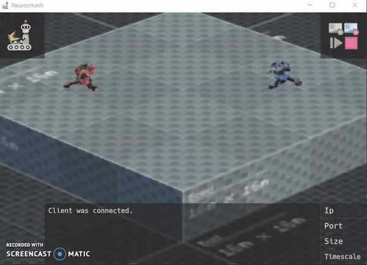

# Neurosmash
Reinforcement Learning Agent

=================

## Descriptions
`run_dqn.py` - Train DQN agent on the Neurosmash environment. Default settings - Size:256, Timescale:10

`Env.py` - Class for sending and recieving data to/from the Neurosmash Unity environment.

`DQN.py` - Implements Q-Learning formula. Based on lecture samples.

---OLD---

`Main.py` - Instantiates a CNN-agent. Loads trained brain from a saved pytorch state_dict into the agent. Then drops the trained agent into an environment, and runs the game a few times.

`Agents.py` - Agent classes for interaction with the environment.

`run_random.py` - Runs multiple games using a randomly-acting agent, and saves the games where the agent *happens* to win. Used for generating training data.

`run_training.py` - Trains an agent from static training data. 
*NOTE: Currently configured for GPU-only mode, as it takes forever to run in CPU mode.*

